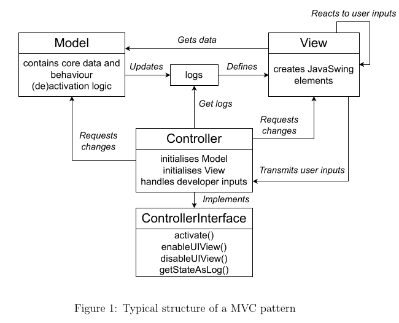

# LINFO2252-project
Project for the course LINFO2252 : Software maintenance and evolution

## Feature model
-> will update frequently and add a copy of the feature model in featureIDE format + png

## Structure of the project

The project is structured as a MVC. 

`src/controller` contains the controller classes, which are responsible for handling user input and updating 
the model and view accordingly.

`src/view` contains the view classes, which are responsible for displaying the data to the user and capturing user input.

`src/model` contains the model classes, which represent the data and business logic of the application.

`src/assets` contains the assets used in the application, such as images, icons, and other resources.

`src/data` contains the data used for the application. Will try to put the database or other data storage (basic txt or json in the beginning -> think about it)

`logs` contains the logs of the application, which can be used for debugging and monitoring purposes. The controller 
will check if the logs folder exists and create it if it doesn't. The logs will be stored in a file named `app.log`.
Think about structure of logs ? => per run, in total ?

`ControllerInterface` : main controller class.

## Usage

The project will later have an UI. But in the first place we will implement a CLI that will be used to interact with the application. 
The CLI will be implemented in the `src/controller/ControllerInterface.py` file.